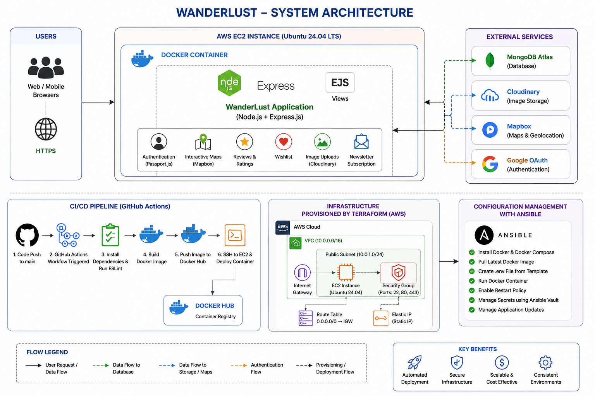
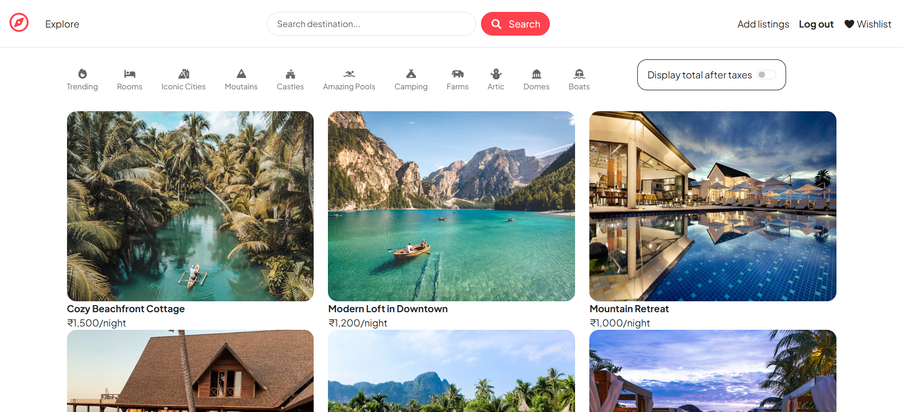
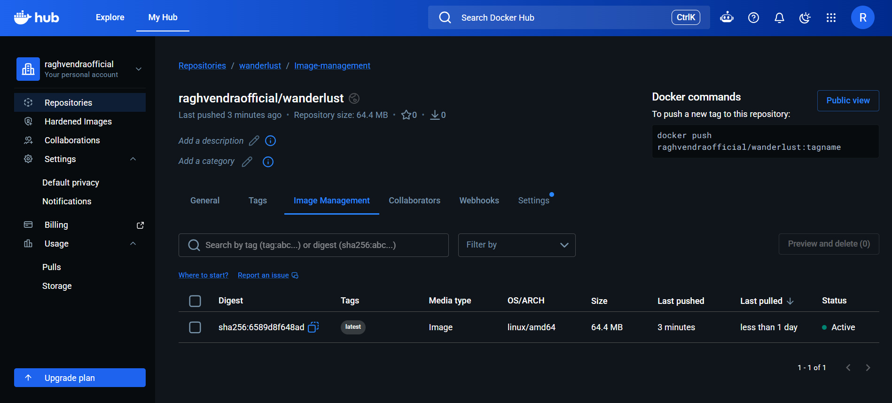
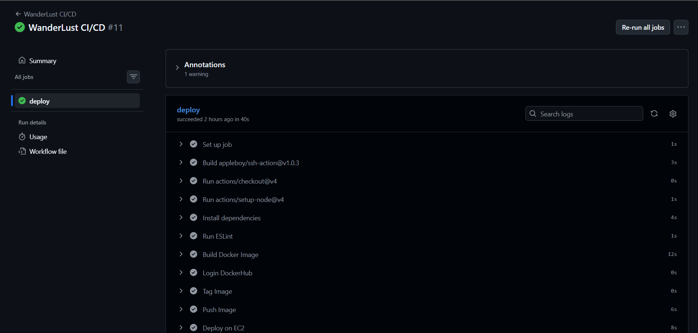
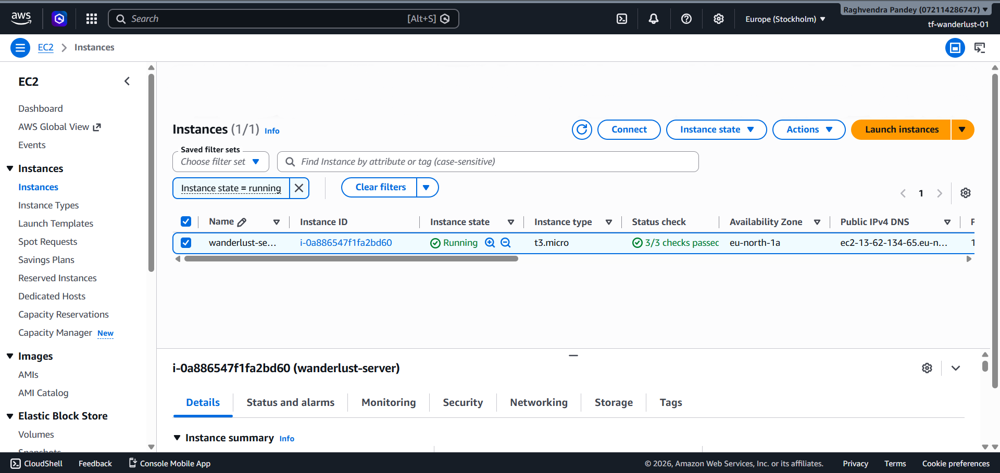

# WanderLust -- Full Stack Travel Accommodation Platform with DevOps Automation


 


## Overview

WanderLust is a production-ready MERN travel accommodation platform with
a complete DevOps pipeline using Docker, GitHub Actions, Terraform, AWS
EC2 and Ansible.

## Features

### Application

-   User Authentication (Local + Google OAuth)
-   CRUD Listings
-   Reviews
-   Wishlist
-   Newsletter
-   Cloudinary Upload
-   Mapbox Integration

### DevOps

-   Docker & Docker Compose
-   Health Checks
-   GitHub Actions CI/CD
-   Docker Hub
-   Terraform Modules
-   AWS Infrastructure
-   Ansible Deployment
-   Ansible Vault

## System Architecture



## Project Structure

``` text
WanderLust/
├── controllers
├── models
├── routes
├── views
├── public
├── terraform
├── ansible
├── .github/workflows
├── Dockerfile
├── docker-compose.yml
└── README.md
```

## Docker

``` bash
docker build -t wanderlust .
docker run -p 8080:8080 wanderlust
```

## Terraform

``` bash
terraform init
terraform apply
terraform destroy
```

## Ansible

``` bash
ansible-playbook playbook.yml --ask-vault-pass
```

## Environment Variables

``` env
ATLASDB_URL=
CLOUD_NAME=
CLOUD_API_KEY=
CLOUD_API_SECRET=
MAP_TOKEN=
GOOGLE_CLIENT_ID=
GOOGLE_CLIENT_SECRET=
SECRET=
PORT=8080
```

## Screenshots

## Landing Page


## Docker Hub


## GitHub Actions


## AWS EC2



## Tech Stack

-   Node.js
-   Express.js
-   MongoDB Atlas
-   Bootstrap
-   Docker
-   GitHub Actions
-   Terraform
-   AWS EC2
-   Ansible


